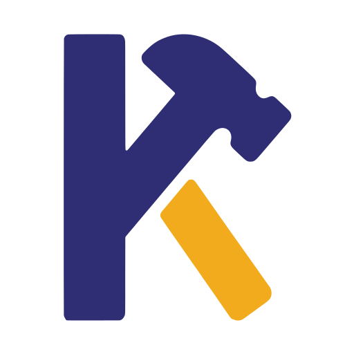

<p align="center">
  <picture>
    <source media="(prefers-color-scheme: dark)" srcset="assets/logo/keyhammer-icon-dark.svg">
    
  </picture>
</p>

# Keyhammer

Typo-tolerant top-k search over a compact trie, with keyboard-aware edit costs.

[](https://github.com/Keyhammer/Keyhammer/actions/workflows/ci.yml)
License: [AGPL-3.0-or-later](LICENSE)

## Status

Early prototype. Nothing is published to crates.io or npm, and the API is
unstable. The new engine is much faster than the previous one. On the
benchmark corpus (300 typo pairs, provisional costs) its ranking quality is
statistically indistinguishable from a simple "edit distance plus frequency"
baseline: no evidence that it is worse, none that it is better. See
[`docs/benchmarks/m0.md`](docs/benchmarks/m0.md).

## What it is

Given a dictionary of terms with frequency weights, Keyhammer returns the top-k
terms closest to a mistyped query. Edit costs depend on the keyboard: hitting a
neighbouring key is cheaper than an arbitrary substitution. The core crate is
`no_std` (it needs `alloc`), uses `forbid(unsafe_code)` and has zero
dependencies. Queries and terms are lowercased bytes for now.

## How it works

- Terms are stored in a compact trie built once from the dictionary.
- Each trie node holds one weighted edit-distance row, computed in a narrow
  band around the diagonal.
- The search is exact best-first top-k: nodes are expanded in order of their
  lower bound, and an oracle test checks the results against brute force.
- By default (`Ranking::Coarse`) results are ranked by the weighted cost
  rounded up to whole units of 16, then by higher frequency weight, then by
  term id. This is not a count of edits: the x1.5 factor on the first byte
  makes an ordinary (non-neighbouring-key) edit there cost 24, i.e. two units,
  while a neighbouring-key substitution there costs 12 (one unit) and a
  transposition 18 (two units); two cheap edits (8 + 8) count as one. The
  weighted costs still
  set the budget and the candidates. `Ranking::Exact` ranks by the exact
  weighted cost instead.
- An optional subtree signature bound (each node keeps the length range and a
  letter mask of the terms below it) prunes subtrees that cannot improve the
  result. On the benchmark data it expands about a third fewer nodes with the
  same results. Its ingredients are already published; see
  [`docs/papers.md`](docs/papers.md).

## Quick start

```rust
use keyhammer::cost::CostModel;
use keyhammer::search::{SearchConfig, Searcher};
use keyhammer::trie::Trie;

let trie = Trie::build(&[
    ("javascript", 10),
    ("typescript", 10),
    ("python", 10),
    ("rust", 10),
    ("java", 10),
])
.unwrap();
let costs = CostModel::qwerty();
let mut searcher = Searcher::new();

// "javasript" skips the 'c' of "javascript".
let out = searcher
    .search(&trie, &costs, b"javasript", &SearchConfig::default())
    .unwrap();
let best = &out.hits[0];
assert_eq!(trie.term(best.id), "javascript");
assert_eq!(best.cost, 16);
```

The same example runs as a doc test in `crates/keyhammer/src/lib.rs`.

The default budget is 32 (about two edits). For higher recall at a latency cost
use `SearchConfig::high_recall()` (budget 48). On the benchmark data it found the
right word more often but expanded about 4.6-5.2x the nodes and had about
5.5-7.3x the p95 latency; one corpus, one machine, see
[`docs/benchmarks/recall-preset.md`](docs/benchmarks/recall-preset.md). Budgets
above 64 are rejected.

## Results so far

Rust-only, one machine, one run, 300 typo pairs (Birkbeck corpus), one English
dictionary, provisional costs. Full dictionary of 274137 words; the baseline is
"unit edit distance <= 2, then higher weight". Full report and caveats (see the
addendum for the current ranking):
[`docs/benchmarks/m0.md`](docs/benchmarks/m0.md).

| Engine | MRR | p95 latency (us) |
|---|---|---|
| legacy (previous engine) | 0.255 | 51773.0 |
| baseline | 0.433 | 78243.6 |
| new+tsb | 0.429 | 370.3 |

The p95 of the previous engine is 139.8x that of the new one. The paired MRR
difference of the new engine minus the baseline is +0.007, -0.003 and -0.004 at
10000, 100000 and 274137 words, with 95% intervals of about +-0.017 that all
contain 0: statistically indistinguishable, not a gain, and these 300 pairs
cannot show parity to within a few thousandths either. Against the engine's
previous ordering by exact cost the gain is significant (+0.015, +0.028 and
+0.040).

## Repository layout

- `crates/keyhammer`: the core crate.
- `legacy/`: the previous engine, kept only as a benchmark reference.
- `crates/node`: Node.js binding of the legacy engine, used by the JS comparison.
- `bench/`: data preparation, the Rust harness and the JS comparison.
- `docs/`: benchmark reports and prior-art notes.
- `docs/design/`: written proofs, currently the lower bound of the search.

## Development

```bash
cargo fmt -p keyhammer -- --check
cargo clippy -p keyhammer --all-targets -- -D warnings
cargo test -p keyhammer
```

Benchmarks:

```bash
cd bench && npm install && node fetch-data.mjs && node prepare-m0-data.mjs
# then, from the repository root:
cargo run --release -p keyhammer-bench --bin m0 -- bench/data
```

The JS comparison (`node compare.mjs` in `bench/`) needs the legacy Node binding
built first. It loads `crates/node/keyhammer.node`:

```bash
cd crates/node && npm install && npx napi build --release --platform
# copy the produced .node file to crates/node/keyhammer.node
```

## Roadmap

- Improve ranking quality against the baseline.
- Unicode support and more keyboard layouts.
- Index serialization.
- Language bindings for the new engine.

## Contributing

See [CONTRIBUTING.md](CONTRIBUTING.md).

## License

`AGPL-3.0-or-later`, see [LICENSE](LICENSE). Earlier commits, published before
the relicense commit ("chore: relicense to AGPL-3.0-or-later"), were released
under MIT.

## References

See [`docs/papers.md`](docs/papers.md).
